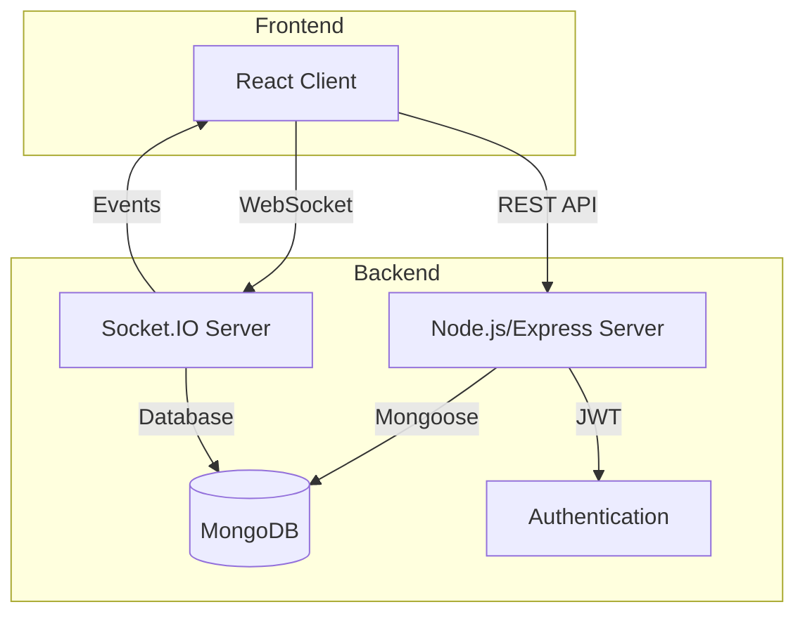

# 🚀 Talksy – Real-Time Chat Application

Talksy is a full-stack real-time chat application that enables users to communicate instantly via one-on-one and group chats. Built with modern web technologies, it features a responsive frontend, a robust backend with REST APIs and WebSocket support, and secure authentication.

---

## 🧠 Architecture Overview



## ✨ Features

* Real-time messaging using Socket.IO with WebSocket fallback
* One-on-one and group chats with dynamic room allocation
* User authentication via JWT (JSON Web Tokens)
* Typing indicators and online status
* Chat management: create, rename, delete, add/remove members
* Message history and chat clearing
* Responsive UI built with React, Redux, and Tailwind CSS
* CORS security with strict origin whitelisting
* Ping-Pong heartbeat (25s interval) to manage zombie connections
* Rate limiting (optional, can be added)

---

## 🛠️ Tech Stack

### 🔹 Frontend

* React.js
* Redux Toolkit
* Tailwind CSS
* Socket.IO Client
* Vite

### 🔹 Backend

* Node.js + Express.js
* MongoDB + Mongoose
* Socket.IO
* JWT Authentication
* Bcrypt.js

### 🔹 Deployment

* Vercel (Frontend & Backend)
* MongoDB Atlas

---

## 🏗️ Architecture

The application follows a client-server architecture:

* Client communicates via REST APIs (CRUD operations)
* WebSockets handle real-time messaging
* Express handles HTTP requests & authentication
* Socket.IO manages connections & rooms
* MongoDB stores users, chats, and messages

---

## 🚀 Getting Started

### 🔧 Prerequisites

* Node.js (v16+)
* npm or yarn
* MongoDB (local or Atlas)

---

### 📥 Installation

```bash
git clone https://github.com/Nitishojha00/Talksy.git
cd talksy
```

---

### ⚙️ Backend Setup

```bash
cd backend
npm install
```

Create `.env` file in backend:

```env
PORT=5000
MONGODB_URI=your_mongodb_connection_string

⚠️ Note:
We are using a placeholder JWT secret key for development. Please replace it with a strong, secure secret in production.

Example:
JWT_SECRET=your_super_secure_random_secret_key

FRONTEND_URL=http://localhost:5173
```

Run backend:

```bash
npx nodemon index.js
```

---

### 🎨 Frontend Setup

```bash
cd frontend
npm install
npm run dev
```

---

## 📡 API Endpoints

| Endpoint                   | Method | Description   |
| -------------------------- | ------ | ------------- |
| /api/auth/register         | POST   | Register user |
| /api/auth/login            | POST   | Login user    |
| /api/user/me               | GET    | Current user  |
| /api/user/all              | GET    | All users     |
| /api/chat                  | POST   | Create chat   |
| /api/chat                  | GET    | Get chats     |
| /api/chat/group            | POST   | Create group  |
| /api/chat/group/rename     | PUT    | Rename group  |
| /api/chat/group/add        | PUT    | Add user      |
| /api/chat/group/remove     | PUT    | Remove user   |
| /api/chat/:chatId          | DELETE | Delete chat   |
| /api/message               | POST   | Send message  |
| /api/message/:chatId       | GET    | Get messages  |
| /api/message/clear/:chatId | DELETE | Clear chat    |

---

## 🔌 Socket Events

| Event            | Description      |
| ---------------- | ---------------- |
| setup            | Initialize user  |
| new message      | Send message     |
| message received | Receive message  |
| join chat        | Join room        |
| typing           | Typing indicator |
| stop typing      | Stop typing      |
| clear chat       | Clear messages   |
| delete chat      | Delete chat      |
| chat created     | New chat         |
| disconnect       | Cleanup          |

---

## 📁 Folder Structure

```
backend/
├── config/
├── controllers/
├── middlewares/
├── models/
├── routes/
├── server.js

frontend/
├── src/
│   ├── components/
│   ├── pages/
│   ├── redux/
│   ├── socket/
│   ├── utils/
│   └── App.jsx
```

---

## 🌐 Deployment

### Backend (Vercel)

* Add environment variables in dashboard
* Deploy using `vercel --prod`

### Frontend (Vercel)

* Set API base URL
* Deploy using `vercel --prod`

---

## 🤝 Contributing

```bash
git checkout -b feature/new-feature
git commit -m "Added feature"
git push origin feature/new-feature
```

---

## 📄 License

MIT License

---

## 📬 Contact

**Nitish Ojha**
📧 [nitishojha00@gmail.com](mailto:nitishojha00@gmail.com)

---

## ⭐ Support

If you like this project, give it a ⭐ on GitHub!

---
